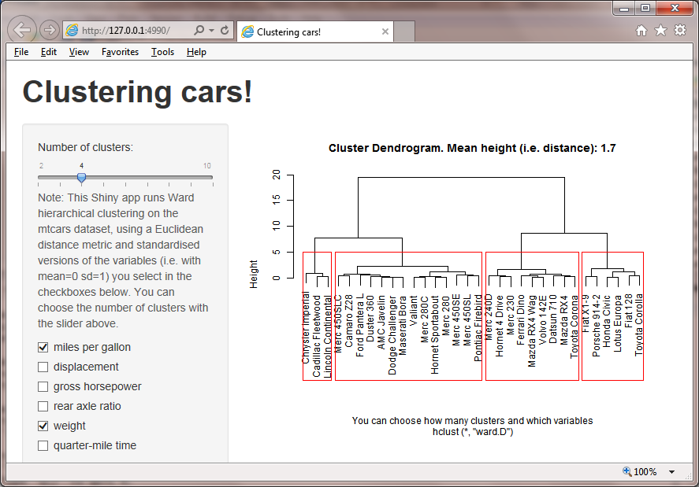
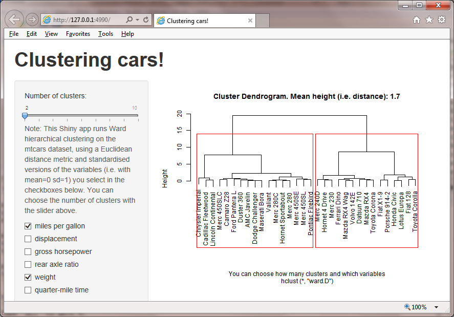
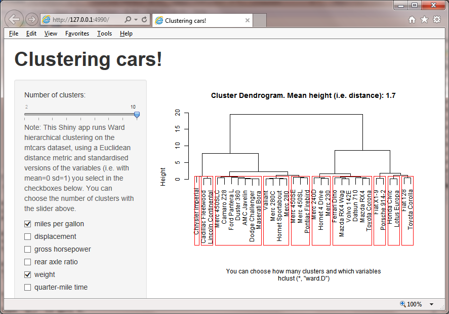
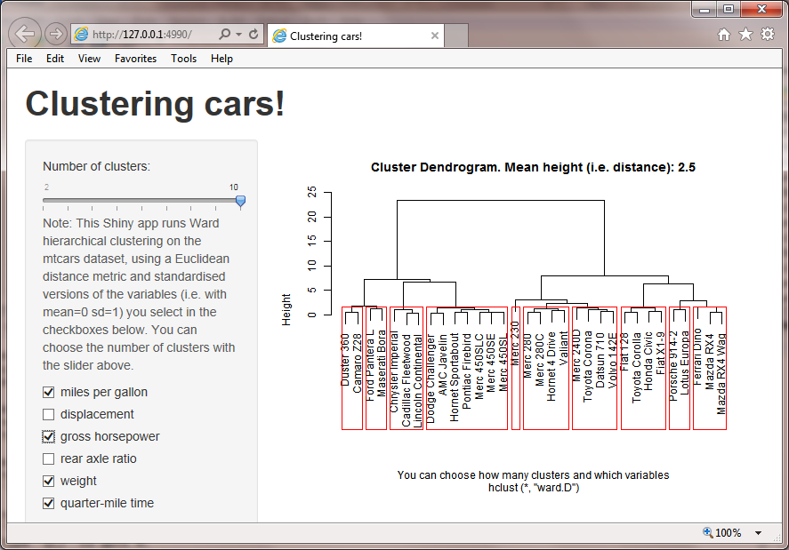
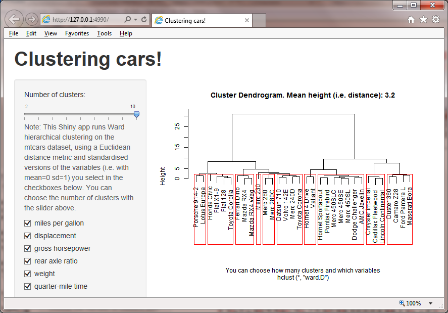
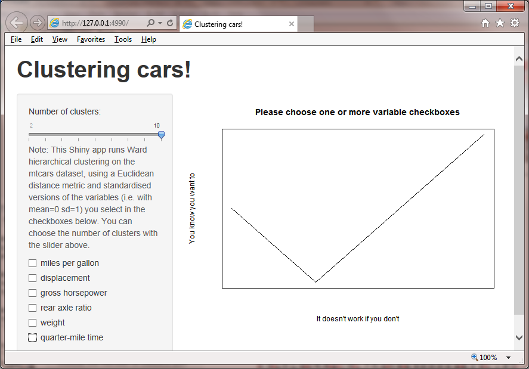
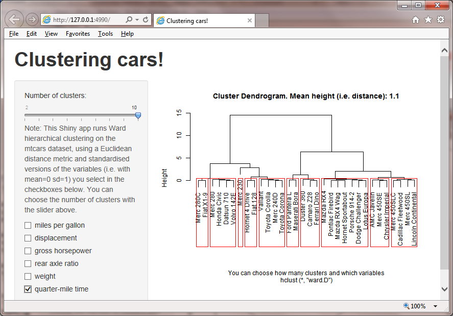

Shiny-car-clustering
====================

Example of Shiny application clustering mtcars 
----------------------------------------------

This repository provides the code for the Shiny application 
**[https://henrygb.shinyapps.io/car_cluster/](https://henrygb.shinyapps.io/car_cluster/)** 
written for peer assessment as part of the Coursera course on 
Developing Data Products.

Click **[here for ui.R](https://github.com/Henrygb/Shiny-car-clustering/blob/master/car_cluster/ui.R)** 
and **[here for server.R](https://github.com/Henrygb/Shiny-car-clustering/blob/master/car_cluster/server.R)** code.

**Because the shinyapps.io site has become sporadically unavailable after the peer-assessment time started, 
I have since added screengrab images below showing what the application shows whan the website is working, 
with different positions of the slider and different checkboxes checked.**  

The application is a visual invitation to slide the slider and 
click on the checkboxes, and then to see how the dendrogram and clusters of cars change.  For those 
who prefer to read more, it says *"Note: This Shiny app runs Ward hierarchical clustering 
on the mtcars dataset, using a Euclidean distance metric and standardised versions of the variables 
(i.e. with mean=0 sd=1) you select in the checkboxes below. You can choose the number of clusters with the slider above"* 

The script server.R changes the clustering calcultions by reacting when the checkboxes or slider 
are changed and reploting the new fitted clusters. 

It also recalculates and redisplays the average distances between cars
using the selected standardised variables 
(equal to the average heights of the branches) 
in the title of the plot on the html page. 
This varies depending on the particular checkboxes selected and the number which are selected. 

Initial screen
--------------

 

Fewer clusters
--------------

 

More clusters
--------------

 

More variables
--------------

 

All variables
--------------

 

No variables
--------------

 

One variable
--------------

 

 
